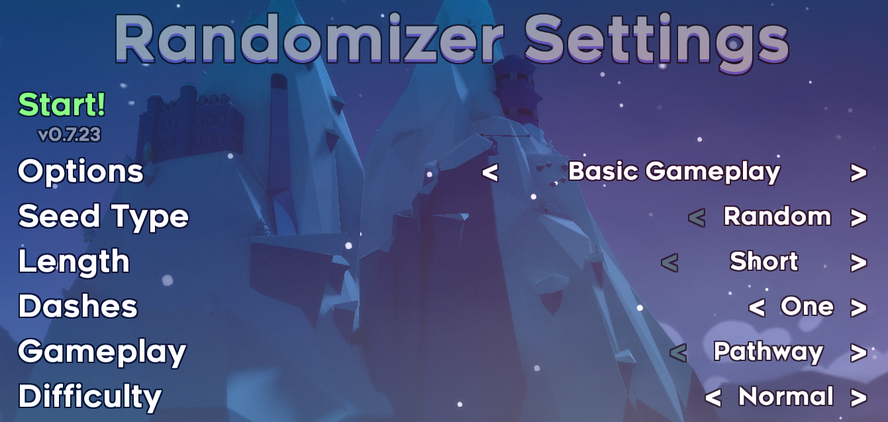

Celeste Randomizer
==================

This is an [Everest](https://everestapi.github.io/) mod for [Celeste](http://www.celestegame.com/) that automatically generates randomly constructed maps by treating each room as a building block that can fit against certain other rooms in designated ways.

Installation
------------

Download from the [gamebanana page](https://gamebanana.com/tools/6848) and copy the zip file into your Celeste installation's `Mods` folder.

Player Advice
-------------

### Difficulty modes

The difficulty modes are intended as follows:

- *Easy:* Player is not extremely familiar with Celeste
- *Normal:* Player is comfortable with the A-sides and can figure out a B-side room given some time
- *Hard:* Player is comfortable with Farewell and the C-Sides, knows a little bit of speedrun tech
- *Expert:* Player is comfortable with spike jumps, corner boosts, easy demodashes
- *Master:* Player is willing to sit down and grind out difficult rooms for a few minutes
- *Perfect:* Player knows the above tech and is willing to suffer with extremely precise and unfair gameplay

If you need a difficulty easier than Easy, you should disable the maps that you don't feel comfortable with.

Of course, all of this is entirely subjective and was categorized by me, so if you have any questions or suggestions on what should be easier or harder, let me know :)

### Map construction algorithms

- The *Pathway* algorithm constructs a straight-line path from a start to an end. It may add side-routes to place keys necessary to proceed. It may not be traversable in reverse.
- The *Labyrinth* algorithm constructs a sprawling map with the summit gems hidden in it and a central hub to which you can return to collect a heart.

Randomizing custom maps
-----------------------

You can add custom maps to the randomizer! All it takes is a lot of clerical work. For each room, you need to describe the exact ways the player is capable of moving from exit to exit in [this format](docs/metadata.md), and then bundle the configuration file with your map (or with another mod, we're not picky).
