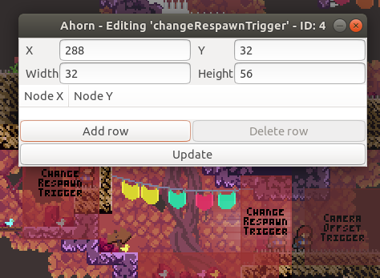
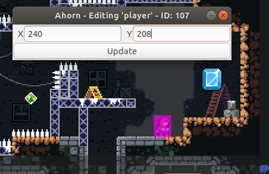
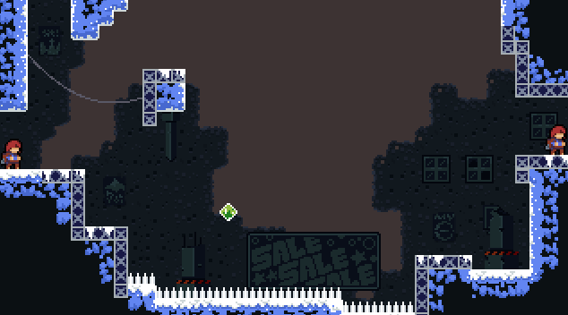

# Metadata Documentation

In order for the randomizer to work, each map must have a configuration file created for it describing for each room how its entrances and exits are linked. The config file should be a resource named "Config/{map SID}.rando.yaml". This means that custom maps can be added to the randomizer too!

These config files are yaml files. If you need an introduction to yaml you may start [here](https://github.com/Animosity/CraftIRC/wiki/Complete-idiot's-introduction-to-yaml).

The general file structure is a map with keys ASide, BSide, and CSide, each containing a list of room descriptions:

```
ASide:
- <room description>
- <room description>
BSide:
- <room description>
- <room description>
CSide:
- <room description>
- <room description>
```

## Rooms

A room description contains the name of the room, a listing of all the Holes in the room (gaps in the level geometry through which the player could theoretically enter or exit) along with their properties. Additionally, it can contain Tweaks (modifications to the level data), Subrooms (room descritpions that allow you to partition some of the room as separate from the rest of the room), and InternalEdges (relationships between subrooms).

```
Room: <room name>
Holes:
- <hole description>
- <hole description>
Tweaks:
- <tweak description>
- <tweak description>
Subrooms:
- <subroom description>
- <subroom description>
InternalEdges:
- <internal edge description>
- <internal edge description>
```

## Holes

To specify which hole you're referring to, you need to specify which side of the room the hole is on (up, down, left, right), and then the index of the hole, counting from hole zero which is the first hole to the top or the left of the edge.

```
Holes:
  - Side: Up
    Idx: 0
```

Then, you can specify the behavior you'd like the hole to have. The most basic behavior is the Kind of the hole, which can be `inout`, `in`, `out`, or `none`. An `in` hole can be used as an entrance to the room, an `out` hole can be used as an exit from the room, and an `inout` hole can be used for both. A `none` hole should not be used ever. There is a fifth, secret hole kind, `unknown`, which is automatically applied to any hole which does not have a configuration specified for it. `unknown` holes are treated as `in` holes when the "Enter Unknown Holes" option is enabled, so you should mark any truly inaccessable hole as `none` so it isn't used as an unknown hole to enter.

Then, you can specify ReqIn, ReqOut, and/or ReqBoth for the hole to describe more specific requirements, such as the number of dashes needed, in order to enter the room using the hole and exit the room using the hole.

```
Holes:
  - Side: Up
    Idx: 0
    Kind: inout
    ReqOut:
      Dashes: one         # for example, is guarded by a breakable block and thus requires a dash
  - Side: Down
    Idx: 0
    Kind: in
  - Side: Down
    Idx: 1
    Kind: out
```

The requirements section will be elaboreted on below.

## Tweaks

Using the tweaks section, you can make edits to the room's entities.

To delete this entity:



Use this syntax:

```
Tweaks:
  - ID: 4     # ID copied from ahorn
    Update:
      Remove: true
```

To add this spawn point:



Use this syntax:

```
Tweaks:
  - Name: spawn
    Update:
      Add: true
      X: 240
      Y: 208
```

You can combine the two syntaxes and specify neither Add nor Remove to update attributes (currently just X Y Width Height) for existing entities. To update the position of spawn points, which don't have an ID, you can specify its starting X and Y coordinates before the update directive.

## Subrooms and Internal Edges

The internal logic of the randomizer treats the level data as a [graph](https://en.wikipedia.org/wiki/Graph_(discrete_mathematics)), where each room is a node and each hole is an edge. The problem with this model is that it assumes that movement within each node is free and each edge can be accessed coming in from any other edge. In order to resolve this problem, we allow rooms to be divided into subrooms and for connections to be described between subrooms. For example, for this room from City:



The best way to describe it would be as follows:

```
  - Room: "6z"
    Holes:
    - Side: Right
      Idx: 0
      Kind: inout
    InternalEdges:
    - To: "left"
      ReqBoth:
        Dashes: one
    Subrooms:
    - Room: "left"
      Holes:
      - Side: Up
        Idx: 0
        Kind: inout
      - Side: Left
        Idx: 0
        Kind: inout
```

A subroom entry is identical to a normal room entry, except that it does not contain any subrooms. We assign the right hole to the main subroom and the two left holes to the left subroom. We then create an InternalEdge linking the main subroom to the left subroom, and say that you need one dash to cross the gap in either direction.

This syntax is a bit bulky for simple cases, so there is a simpler mechanism that you can use when a room only has exactly two non-none-kind holes:

```
  - Room: "00"
    Holes:
    - Side: Left
      Idx: 0
      Kind: inout
    - Side: Up
      Idx: 0
      Kind: inout
    InternalEdges:
    - Split: BottomToTop
      ReqOut:
        Dashes: one
      ReqIn:
        Dashes: zero
```

The Split directive on the internal edge will cause one of the holes to be broken off into a new subroom, and for there to be a new edge drawn between the subroom the internaledge is part of and the newly created subroom. The split can be any of `BottomToTop`, `TopToBottom`, `LeftToRight`, or `RightToLeft`. The distinction between BottomToTop and TopToBottom is that in the former, the top-most hole will be put in the new subroom, and in the latter, the bottom-most hole will be put in the new subroom. The only time this matters is that when the room is used as the starting room for a map, the randomizer logic will assume you start in the main subroom.

## Requirements

Now, let's finally get to the bottom of these ReqIn/ReqOut/ReqBoth directives. A requirement directive can contain any of the following keys:

```
Dashes: {zero, one, two (default)}
Difficulty: {normal (default), hard, expert, perfect}
Or: [list of sub-requirements]
```

If two or more of the keys are specified, it means that you need both of those things to traverse the room in that way. So, to put it all together, if you have a room which can be traversed easily with two dashes but only takes one dash if you know some advanced techinques, you would describe it like this:

```
ReqBoth:
  Or:
  - Dashes: two
  - Dashes: one
    Difficulty: hard
```
