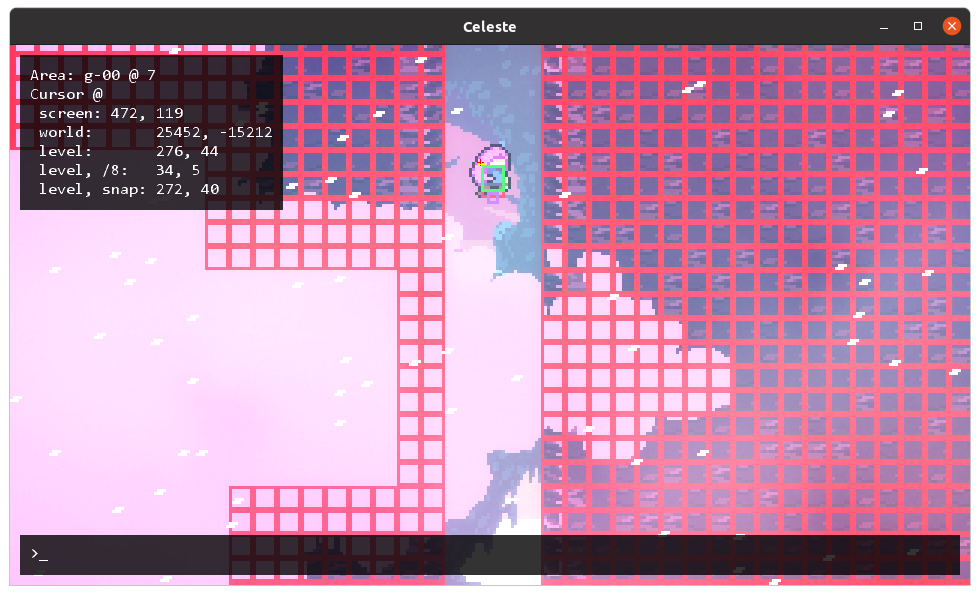

# Metadata Documentation

In order for the randomizer to work, each map must have a configuration file created for it describing for each room how its entrances and exits are linked. The config file should be a resource named "Config/{map SID}.rando.yaml". This means that custom maps can be added to the randomizer too! If you want to add configuration which applies to something which is agnostic from a map, for example, the name of a new music track to add to the mix, you should place it in a file named "rando.yaml" and give it a unique path (if you just name it "Config/rando.yaml" you may have a name conflict with another mod and Everest will refuse to load both of them).

These config files are yaml files. If you need an introduction to yaml you may start [here](https://github.com/Animosity/CraftIRC/wiki/Complete-idiot's-introduction-to-yaml). If you would like to look at some examples of this format, you can look at the [bundled metadata for Celeste's maps](../Randomizer/Config/Celeste).

The general map descriptor file structure is a dict with keys ASide, BSide, and CSide, each containing a list of room descriptions:

```
ASide:
- <room description>
- <room description>
BSide:
- <room description>
- <room description>
CSide:
- <room description>
- <room description>
```

## Rooms

A room description contains the name of the room, a listing of all the Holes in the room (gaps in the level geometry through which the player could theoretically enter or exit) along with their properties. Additionally, it can contain Tweaks (modifications to the level data), Subrooms (room descriptions that allow you to partition some of the room as separate from the rest of the room) InternalEdges (relationships between subrooms), and Collectables (keys and berries). It may also contain a key called End, indicating whether this room can be used to end the level. Rooms with crystal hearts should be classified as level-ending.

```
Room: <room name>
Holes:
- <hole description>
- <hole description>
Tweaks:
- <tweak description>
- <tweak description>
Subrooms:
- <subroom description>
- <subroom description>
InternalEdges:
- <internal edge description>
- <internal edge description>
Collectables:
- <collectable description>
- <collectable description>
ExtraSpace:
- <rectangle>
- <rectangle>
Flags:
- <flag setter>
- <flag setter>
ReqEnd: <ending requirements>
Hub: {true/false}
Core: <core mode description>
Worth: <room length number>
SpinnersShatter: {true/false}
```

## Holes

To specify which hole you're referring to, you need to specify which side of the room the hole is on (up, down, left, right), and then the index of the hole, counting from hole zero which is the first hole to the top or the left of the edge.

```
Holes:
  - Side: Up
    Idx: 0
```

Then, you can specify the behavior you'd like the hole to have. The most basic behavior is the Kind of the hole, which can be `inout`, `in`, `out`, or `none`. An `in` hole can be used as an entrance to the room, an `out` hole can be used as an exit from the room, and an `inout` hole can be used for both. A `none` hole should not be used ever. There is a fifth, secret hole kind, `unknown`, which is automatically applied to any hole which does not have a configuration specified for it. `unknown` holes are treated as `in` holes when the "Enter Unknown Holes" option is enabled, so you should mark any truly inaccessable hole as `none` so it isn't used as an unknown hole to enter.

Then, you can specify ReqIn, ReqOut, and/or ReqBoth for the hole to describe more specific requirements, such as the number of dashes needed, in order to enter the room using the hole and exit the room using the hole.

```
Holes:
  - Side: Up
    Idx: 0
    Kind: inout
    ReqOut:
      Dashes: one         # for example, is guarded by a breakable block and thus requires a dash
  - Side: Down
    Idx: 0
    Kind: in
  - Side: Down
    Idx: 1
    Kind: out
```

The requirements section will be elaboreted on below.

For holes which are used with a badeline launch, you should set the Launch parameter to the coordinate/8 of Madeline's x-position during the launch. For example:



This hole should be marked up as:

```
  - Side: Up
    Idx: 0
    Kind: out  # all badeline launches must be marked as out-only
    Launch: 34
```

The Launch parameter can be set for any Up or Down hole, though it is only required for Down holes which would otherwise never be used (think: the 7b cassette room).

If you want to edit the boundaries of a hole (for example, if an entity blocks part of it), you can specify the `LowBound` and `HighBound` parameters. These should contain the coordinates/8 of the tiles which are the furthest left/top and right/bottom of the hole but still inside the hole, respectively. If you want to mark the hole as being half-open, i.e. it only has one side, you can set `LowBound: 0` to get rid of the left boundary and `HighOpen: true` to get rid of the right boundary.

If you want to create a _new_ hole (for example, you took a large hole and made it half-open and you want to make a new hole representing the half-open other side), you can omit the `Idx` parameter and instead specify `New: true`. If you do this, you must specify both `LowBound` and `HighBound`.

## Core Mode

You can specify the core mode you would like the room to be in when entered from any given direction:

```
Core:
  All: hot
  Left: cold
  Right: none
  Up: hot
  Down: cold
```

If you omit any of the fields the All field will be used for that instead. the All field is also what is used if you just spawn in the room as a starting room.

## Worth

When building a pathway map, each room adds its worth to the length of the map, and the map ends when it exceeds a certain (stochastic) threshold. Furthermore, too-big rooms are excluded from eligibility depending on the length of the map - a short pathway shouldn't just be two huge rooms. A room's worth is by default its diagonal size, normalized such that the smallest possible screen has a worth of 1. If you want to override this, for example, to make an autoscroller room count as longer than it would otherwise be, you can specify the `Worth` parameter in the room description.

## SpinnersShatter

If the room contains spinners that madeline is launched into and subsequently shatter (think: the last room before Stubbornness in Farewell), it won't work if the randomizer decides that those spinners should actually be dust bunnies. To prevent this from happening, set `SpinnersShatter: true`.

## ExtraSpace

If a room requires you to be able to jump above the screen at a certain point or requires a block to fall off the bottom of the screen, you can ensure that the randomizer will never place another room in that spot by specify the `ExtraSpace` parameter. It looks something like this:

```
    ExtraSpace:
    - X: 368
      Y: 168
      Width: 16
      Height: 112
```

These coordinates are in level-space - the easiest way to get them is to make a big dashBlock or similar in ahorn which extends offscreen into the part that needs to be kept clear and copy its coordinates. It doesn't matter if ExtraSpace directives overlap with the main room or with each other.

## Flags

If a room can set a certain session flag which affects the traversability of other rooms, you will want to denote this with a `Flags` entry. For example, the books switch in huge mess is annotated like so:

```
    Flags:
      - books:set
```

This means you can set the flag `books` in this room. If somehow you had a switch which could clutter up the books again, you would mark it as `books:unset`.

Keep in mind that the logic will assume that the flag-setters are "free", i.e. requiring no dashes or difficulty, so if a flag requires a dash, put it in a separate subroom, like so:

```
    InternalEdges:
      - To: "switch"
        ReqBoth:
          Dashes: one
    Subrooms:
      - Room: "switch"
        Flags:
          - books:set
```

## Hub

If a room is marked `Hub: true`, its usable exits will be lit up when the Illuminate Path option is set to Hub Rooms Only.

## Tweaks

Using the tweaks section, you can make edits to the room's entities.

To delete this entity:


Use this syntax:

```
Tweaks:
  - ID: 4     # ID copied from ahorn
    Name: "changeRespawnTrigger"
    Update:
      Remove: true
```

The `Name` field is optional, and is provided to disambiguate between normal entities and triggers, which can have overlapping ID numbers.

To add this spawn point:


Use this syntax:

```
Tweaks:
  - Name: spawn
    Update:
      Add: true
      X: 240
      Y: 208
```

You can combine the two syntaxes and specify neither Add nor Remove to update attributes for existing entities. To update the position of spawn points, which don't have an ID, you can specify its starting X and Y coordinates before the update directive.

X, Y, Width, and Height can be specified as subkeys of Update in order to change the entity's position and dimentions, you can also update its nodes and its additional properties. the Values subkey should be a mapping from name to string, and the entity's Values dictionary will be updated accordingly. Unfortunately, the only way I've been able to find the exact right names to use for Values keys is by decompiling the game... For nodes, you can specify a subkey Nodes which contains a list of mappings containing keys Idx, X, and Y. Look at the existing metadata for examples.

## Subrooms and Internal Edges

The internal logic of the randomizer treats the level data as a [graph](https://en.wikipedia.org/wiki/Graph_(discrete_mathematics)), where each room is a node and each hole is an edge. The problem with this model is that it assumes that movement within each node is free and each edge can be accessed coming in from any other edge. In order to resolve this problem, we allow rooms to be divided into subrooms and for connections to be described between subrooms. For example, for this room from City:


The best way to describe it would be as follows:

```
  - Room: "6z"
    Holes:
    - Side: Right
      Idx: 0
      Kind: inout
    InternalEdges:
    - To: "left"
      ReqOut:
        Dashes: one
      ReqIn:
        Dashes: zero
    Subrooms:
    - Room: "left"
      Holes:
      - Side: Up
        Idx: 0
        Kind: inout
      - Side: Left
        Idx: 0
        Kind: inout
```

A subroom entry is identical to a normal room entry, except that it does not contain any subrooms. We assign the right hole to the main subroom and the two left holes to the left subroom. We then create an InternalEdge linking the main subroom to the left subroom, and say that you need one dash to cross the gap to the left, and no dashes to cross it to the right.

This syntax is a bit bulky for simple cases, so there is a simpler mechanism that you can use when a room only has exactly two non-none-kind holes:

```
  - Room: "00"
    Holes:
    - Side: Left
      Idx: 0
      Kind: inout
    - Side: Up
      Idx: 0
      Kind: inout
    InternalEdges:
    - Split: BottomToTop
      ReqOut:
        Dashes: one
      ReqIn:
        Dashes: zero
```

The Split directive on the internal edge will cause one of the holes to be broken off into a new subroom, and for there to be a new edge drawn between the subroom the internaledge is part of and the newly created subroom. The split can be any of `BottomToTop`, `TopToBottom`, `LeftToRight`, or `RightToLeft`. The distinction between BottomToTop and TopToBottom is that in the former, the top-most hole will be put in the new subroom, and in the latter, the bottom-most hole will be put in the new subroom. The only time this matters is that when the room is used as the starting room for a map, the randomizer logic will assume you start in the main subroom.

## Requirements

Now, let's finally get to the bottom of these ReqIn/ReqOut/ReqBoth directives. A requirement directive can contain any of the following keys:

```
Dashes: {zero, one, two (default)}
Difficulty: {normal (default), hard, expert, perfect}
Key: {true, false}   # that is, set it to true if the path is blocked by a locked door
Flag: [flag string]
Or: [list of sub-requirements]
And: [list of sub-requirements]
```

If two or more of the keys are specified, it means that you need both of those things to traverse the room in that way. So, to put it all together, if you have a room which can be traversed easily with two dashes but only takes one dash if you know some advanced techinques, you would describe it like this:

```
ReqBoth:
  Or:
  - Dashes: two
  - Dashes: one
    Difficulty: hard
```

If you specify that something is blocked by a locked door, you should also specify the `KeyholeID` attribute, which is the ID of the lockBlock entity. We remove all unused lock blocks, so in order to know that this block is not unused, we need to know which entity to not remove. This will look something like this:

```
ReqBoth:
  Dashes: zero
  Key: true
  KeyholeID: 12
```

In order to specify that a certain session flag must be set or unset in order to traverse a certain path, use the `Flag` key, specifying that the given flag must be either `set` or `unset`:

```
ReqOut:
  Or:
  - Dashes: one
    Flag: boxes:unset
  - Dashes: one
    Difficulty: hard
  - Dashes: two
```

## Collectables

You can specify which subrooms contain which collectables, i.e. keys and berries. The syntax for this is as follows:

```
  - Room: "a-00"
    Collectables:
    - Idx: 0
```

Where the idx is the index of the collectable, with the first (zeroth) collectable being at the top right, and the numbering proceeding left to right and then top to bottom, like scanlines on a television.

Recall that we have the assumption that movement is free within each subroom. So then, if a berry requires a dash to reach, it is important that it be placed in a separate subroom with an edge and a dash requirement. This is very cumbersome, so there is a special syntax you can use in the `InternalEdges` key to automatically split a collectable off into its own subroom:

```
  - Room: "a-00"
    ...
    InternalEdges:
    - Collectable: 0
      ReqOut:
        Dashes: one
      ReqIn:
        Dashes: zero
```

As of right now you can't add new collectables to fun spots, though this is a planned feature.

## The generic rando.yaml

As discussed above, you can put map-agnostic information in a file named "rando.yaml". This file should have the following structure:

```
CollectableNames:
  - "name of collectable entity"
  - "name of collectable entity"
Music:
  - Name: "name of music track event"
    Weight: {float which is larger or smaller than one to make the track appear more or less oftne}
  - Name: "name"
    Weight: 0.5
Campaigns:
  - Name: "Name of campaign"
    LevelSets:
      - "ID of levelset"
      - "ID of levelset"
Rulesets:
- Name: example
  LongName: Example A # name that shows up on the rulesets menu
  RepeatRooms: {true/false}
  EnterUnknown: {true/false}
  Variants: {true/false}
  Lights: {On/Hubs/Off}
  Darkness: {Never/Vanilla/Always}
  Algorithm: {Pathway/Labyrinth/Endless}
  Length: {Short/Medium/Long/Enormous}
  Dashes: {Zero/One/Two}
  Difficulty: {Easy/Normal/Hard/Expert/Master/Perfect}
  EnabledMaps:
  - SID: "SID of level"
    Mode: 0 # A-Side
  - SID: "SID of level"
    Mode: 1 # B-Side
  - SID: "SID of level"
    Mode: 2 # C-Side
```

The CollectableNames are the names of the entities which should be considered as collectables, i.e. valid places to put strawberries, keys, gems. The music tracks are fmod event names, for example `"event:/music/lvl1/main"`.

The campaign system is designed for mods which add a huge number of small maps which ought to be toggled in large swaths, like the spring 2020 collab. If you add a levelset to a campaign, it won't show up as a toggle by itself, but rather one toggle will appear for the whole campaign.

## Debugging

There are a handful of ways malformed metadata can cause errors. The first is that you have described a layout which is actually not possible to traverse, in which case the randomizer may generate impossible maps. The second is if you have an error in your YAML syntax, in which case Celeste will crash on startup with a helpful error. The third is if you describe in correct syntax things which do not exist in the level, such as extra holes or collectables. This will also cause Celeste to crash on startup; I've tried to make these error messages as friendly as possible, but if you can't tell what you've done wrong, drop me a line and I'll help you out.
